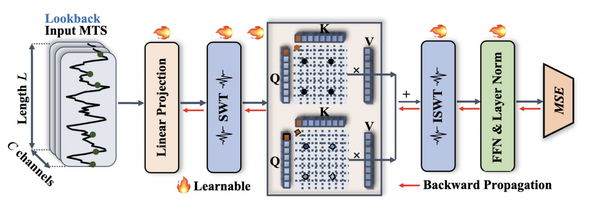
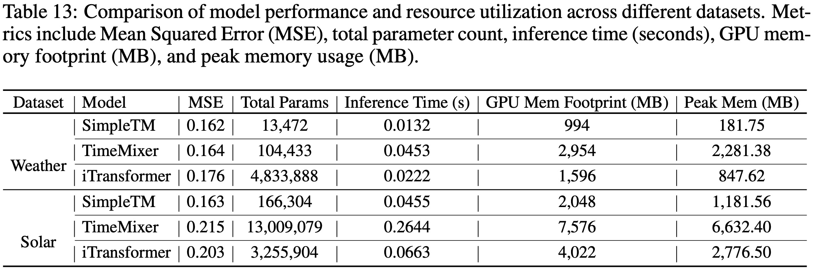

# SimpleTM
The repo is the official implementation for the paper: [[ICLR '25] SimpleTM: A Simple Baseline For Multivariate Time Series Forcasting](https://openreview.net/pdf?id=oANkBaVci5).


# Introduction
We propose SimpleTM, a simple yet effective architecture that uniquely integrates classical signal processing ideas with a slightly modified attention mechanism. 

<p align="center">

</p>

We show that even a single-layer configuration can effectively capture intricate dependencies in multivariate time-series data, while maintaining minimal model complexity and parameter requirements. This streamlined construction achieves a performance profile surpassing (or on par with) most existing baselines across nearly all publicly available benchmarks.

<!-- <p align="center">

</p> -->

<table style="border-collapse: collapse; width: 100%;">
  <caption style="text-align: left; font-weight: bold; padding: 8px;">
    Table 6: Complete results of the long-term forecasting task, with an input length of 96 for all tasks. The reported metrics include the averaged Mean Squared Error (MSE) and Mean Absolute Error (MAE) across four prediction horizons, where lower values indicate better model performance.
  </caption>
  <thead>
    <!-- First header row: model names -->
    <tr style="border-bottom: 2px solid black;">
      <!-- First two columns: Dataset, Horizon (rowspan=2) -->
      <th style="padding: 4px;" rowspan="2">Dataset</th>
      <th style="padding: 4px;" rowspan="2">Horizon</th>
      <!-- Then 14 models, each spanning two columns (MSE, MAE) -->
      <th style="padding: 4px;" colspan="2">SimpleTM (Ours)</th>
      <th style="padding: 4px;" colspan="2">TimeMixer (2024)</th>
      <th style="padding: 4px;" colspan="2">iTransformer (2024)</th>
      <th style="padding: 4px;" colspan="2">CrossGNN (2024)</th>
      <th style="padding: 4px;" colspan="2">RLinear (2023)</th>
      <th style="padding: 4px;" colspan="2">PatchTST (2023)</th>
      <th style="padding: 4px;" colspan="2">Crossformer (2023)</th>
      <th style="padding: 4px;" colspan="2">TiDE (2023)</th>
      <th style="padding: 4px;" colspan="2">TimesNet (2023)</th>
      <th style="padding: 4px;" colspan="2">DLinear (2023)</th>
      <th style="padding: 4px;" colspan="2">SCINet (2022)</th>
      <th style="padding: 4px;" colspan="2">FEDformer (2022)</th>
      <th style="padding: 4px;" colspan="2">Stationary (2022)</th>
      <th style="padding: 4px;" colspan="2">Autoformer (2021)</th>
    </tr>
    <!-- Second header row: MSE / MAE labels -->
    <tr style="border-bottom: 2px solid black;">
      <th style="padding: 4px;">MSE</th>
      <th style="padding: 4px;">MAE</th>
      <th style="padding: 4px;">MSE</th>
      <th style="padding: 4px;">MAE</th>
      <th style="padding: 4px;">MSE</th>
      <th style="padding: 4px;">MAE</th>
      <th style="padding: 4px;">MSE</th>
      <th style="padding: 4px;">MAE</th>
      <th style="padding: 4px;">MSE</th>
      <th style="padding: 4px;">MAE</th>
      <th style="padding: 4px;">MSE</th>
      <th style="padding: 4px;">MAE</th>
      <th style="padding: 4px;">MSE</th>
      <th style="padding: 4px;">MAE</th>
      <th style="padding: 4px;">MSE</th>
      <th style="padding: 4px;">MAE</th>
      <th style="padding: 4px;">MSE</th>
      <th style="padding: 4px;">MAE</th>
      <th style="padding: 4px;">MSE</th>
      <th style="padding: 4px;">MAE</th>
      <th style="padding: 4px;">MSE</th>
      <th style="padding: 4px;">MAE</th>
      <th style="padding: 4px;">MSE</th>
      <th style="padding: 4px;">MAE</th>
      <th style="padding: 4px;">MSE</th>
      <th style="padding: 4px;">MAE</th>
      <th style="padding: 4px;">MSE</th>
      <th style="padding: 4px;">MAE</th>
    </tr>
  </thead>
  <tbody>
    <!-- ================= ETTm1 ================= -->
    <tr style="border-bottom: 1px solid black;">
      <td style="padding: 4px;" rowspan="5">ETTm1</td>
      <td style="padding: 4px;">96</td>
      <!-- SimpleTM (Ours): best (red + bold) -->
      <td style="padding: 4px;">
        <span style="color: red; font-weight: bold;">0.321</span>
      </td>
      <td style="padding: 4px;">
        <span style="color: red; font-weight: bold;">0.361</span>
      </td>
      <!-- TimeMixer: second best (blue + underline) -->
      <td style="padding: 4px;">
        <span style="text-decoration: underline; color: blue;">0.328</span>
      </td>
      <td style="padding: 4px;">
        <span style="text-decoration: underline; color: blue;">0.363</span>
      </td>
      <td style="padding: 4px;">0.334</td>
      <td style="padding: 4px;">0.368</td>
      <td style="padding: 4px;">0.335</td>
      <td style="padding: 4px;">0.373</td>
      <td style="padding: 4px;">0.355</td>
      <td style="padding: 4px;">0.376</td>
      <td style="padding: 4px;">0.329</td>
      <td style="padding: 4px;">0.367</td>
      <td style="padding: 4px;">0.404</td>
      <td style="padding: 4px;">0.426</td>
      <td style="padding: 4px;">0.364</td>
      <td style="padding: 4px;">0.387</td>
      <td style="padding: 4px;">0.338</td>
      <td style="padding: 4px;">0.375</td>
      <td style="padding: 4px;">0.345</td>
      <td style="padding: 4px;">0.372</td>
      <td style="padding: 4px;">0.418</td>
      <td style="padding: 4px;">0.438</td>
      <td style="padding: 4px;">0.379</td>
      <td style="padding: 4px;">0.419</td>
      <td style="padding: 4px;">0.386</td>
      <td style="padding: 4px;">0.398</td>
      <td style="padding: 4px;">0.505</td>
      <td style="padding: 4px;">0.475</td>
    </tr>
    <tr style="border-bottom: 1px solid black;">
      <td style="padding: 4px;">192</td>
      <td style="padding: 4px;">
        <span style="color: red; font-weight: bold;">0.360</span>
      </td>
      <td style="padding: 4px;">
        <span style="color: red; font-weight: bold;">0.380</span>
      </td>
      <td style="padding: 4px;">
        <span style="text-decoration: underline; color: blue;">0.364</span>
      </td>
      <td style="padding: 4px;">
        <span style="text-decoration: underline; color: blue;">0.384</span>
      </td>
      <td style="padding: 4px;">0.377</td>
      <td style="padding: 4px;">0.391</td>
      <td style="padding: 4px;">0.372</td>
      <td style="padding: 4px;">0.390</td>
      <td style="padding: 4px;">0.391</td>
      <td style="padding: 4px;">0.392</td>
      <td style="padding: 4px;">0.367</td>
      <td style="padding: 4px;">0.385</td>
      <td style="padding: 4px;">0.450</td>
      <td style="padding: 4px;">0.451</td>
      <td style="padding: 4px;">0.398</td>
      <td style="padding: 4px;">0.404</td>
      <td style="padding: 4px;">0.374</td>
      <td style="padding: 4px;">0.387</td>
      <td style="padding: 4px;">0.380</td>
      <td style="padding: 4px;">0.389</td>
      <td style="padding: 4px;">0.439</td>
      <td style="padding: 4px;">0.450</td>
      <td style="padding: 4px;">0.426</td>
      <td style="padding: 4px;">0.441</td>
      <td style="padding: 4px;">0.459</td>
      <td style="padding: 4px;">0.444</td>
      <td style="padding: 4px;">0.553</td>
      <td style="padding: 4px;">0.496</td>
    </tr>
    <tr style="border-bottom: 1px solid black;">
      <td style="padding: 4px;">336</td>
      <td style="padding: 4px;">
        <span style="text-decoration: underline; color: blue;">0.390</span>
      </td>
      <td style="padding: 4px;">
        <span style="color: red; font-weight: bold;">0.404</span>
      </td>
      <td style="padding: 4px;">
        <span style="color: red; font-weight: bold;">0.390</span>
      </td>
      <td style="padding: 4px;">
        <span style="text-decoration: underline; color: blue;">0.404</span>
      </td>
      <td style="padding: 4px;">0.426</td>
      <td style="padding: 4px;">0.420</td>
      <td style="padding: 4px;">0.403</td>
      <td style="padding: 4px;">0.411</td>
      <td style="padding: 4px;">0.424</td>
      <td style="padding: 4px;">0.415</td>
      <td style="padding: 4px;">0.399</td>
      <td style="padding: 4px;">0.410</td>
      <td style="padding: 4px;">0.532</td>
      <td style="padding: 4px;">0.515</td>
      <td style="padding: 4px;">0.428</td>
      <td style="padding: 4px;">0.425</td>
      <td style="padding: 4px;">0.410</td>
      <td style="padding: 4px;">0.411</td>
      <td style="padding: 4px;">0.413</td>
      <td style="padding: 4px;">0.413</td>
      <td style="padding: 4px;">0.490</td>
      <td style="padding: 4px;">0.485</td>
      <td style="padding: 4px;">0.445</td>
      <td style="padding: 4px;">0.459</td>
      <td style="padding: 4px;">0.495</td>
      <td style="padding: 4px;">0.464</td>
      <td style="padding: 4px;">0.621</td>
      <td style="padding: 4px;">0.537</td>
    </tr>
    <tr style="border-bottom: 1px solid black;">
      <td style="padding: 4px;">720</td>
      <td style="padding: 4px;">
        <span style="color: red; font-weight: bold;">0.454</span>
      </td>
      <td style="padding: 4px;">
        <span style="color: red; font-weight: bold;">0.438</span>
      </td>
      <td style="padding: 4px;">0.458</td>
      <td style="padding: 4px;">0.445</td>
      <td style="padding: 4px;">0.491</td>
      <td style="padding: 4px;">0.459</td>
      <td style="padding: 4px;">0.461</td>
      <td style="padding: 4px;">0.442</td>
      <td style="padding: 4px;">0.487</td>
      <td style="padding: 4px;">0.450</td>
      <td style="padding: 4px;">
        <span style="text-decoration: underline; color: blue;">0.454</span>
      </td>
      <td style="padding: 4px;">
        <span style="text-decoration: underline; color: blue;">0.439</span>
      </td>
      <td style="padding: 4px;">0.666</td>
      <td style="padding: 4px;">0.589</td>
      <td style="padding: 4px;">0.487</td>
      <td style="padding: 4px;">0.461</td>
      <td style="padding: 4px;">0.478</td>
      <td style="padding: 4px;">0.450</td>
      <td style="padding: 4px;">0.474</td>
      <td style="padding: 4px;">0.453</td>
      <td style="padding: 4px;">0.595</td>
      <td style="padding: 4px;">0.550</td>
      <td style="padding: 4px;">0.543</td>
      <td style="padding: 4px;">0.490</td>
      <td style="padding: 4px;">0.585</td>
      <td style="padding: 4px;">0.516</td>
      <td style="padding: 4px;">0.671</td>
      <td style="padding: 4px;">0.561</td>
    </tr>
    <!-- "Avg" row -->
    <tr style="border-bottom: 2px solid black;">
      <td style="padding: 4px;">Avg</td>
      <td style="padding: 4px;">
        <span style="color: red; font-weight: bold;">0.381</span>
      </td>
      <td style="padding: 4px;">
        <span style="color: red; font-weight: bold;">0.396</span>
      </td>
      <td style="padding: 4px;">
        <span style="text-decoration: underline; color: blue;">0.385</span>
      </td>
      <td style="padding: 4px;">
        <span style="text-decoration: underline; color: blue;">0.399</span>
      </td>
      <td style="padding: 4px;">0.407</td>
      <td style="padding: 4px;">0.410</td>
      <td style="padding: 4px;">0.393</td>
      <td style="padding: 4px;">0.404</td>
      <td style="padding: 4px;">0.414</td>
      <td style="padding: 4px;">0.407</td>
      <td style="padding: 4px;">0.387</td>
      <td style="padding: 4px;">0.400</td>
      <td style="padding: 4px;">0.513</td>
      <td style="padding: 4px;">0.496</td>
      <td style="padding: 4px;">0.419</td>
      <td style="padding: 4px;">0.419</td>
      <td style="padding: 4px;">0.400</td>
      <td style="padding: 4px;">0.406</td>
      <td style="padding: 4px;">0.403</td>
      <td style="padding: 4px;">0.407</td>
      <td style="padding: 4px;">0.485</td>
      <td style="padding: 4px;">0.481</td>
      <td style="padding: 4px;">0.448</td>
      <td style="padding: 4px;">0.452</td>
      <td style="padding: 4px;">0.481</td>
      <td style="padding: 4px;">0.456</td>
      <td style="padding: 4px;">0.588</td>
      <td style="padding: 4px;">0.517</td>
    </tr>
    <!-- ================= ETTm2 ================= -->
    <tr style="border-bottom: 1px solid black;">
      <td style="padding: 4px;" rowspan="5">ETTm2</td>
      <td style="padding: 4px;">96</td>
      <td style="padding: 4px;">
        <span style="color: red; font-weight: bold;">0.173</span>
      </td>
      <td style="padding: 4px;">
        <span style="color: red; font-weight: bold;">0.257</span>
      </td>
      <td style="padding: 4px;">0.176</td>
      <td style="padding: 4px;">0.259</td>
      <td style="padding: 4px;">0.180</td>
      <td style="padding: 4px;">0.264</td>
      <td style="padding: 4px;">0.176</td>
      <td style="padding: 4px;">0.266</td>
      <td style="padding: 4px;">0.182</td>
      <td style="padding: 4px;">0.265</td>
      <td style="padding: 4px;">
        <span style="text-decoration: underline; color: blue;">0.175</span>
      </td>
      <td style="padding: 4px;">
        <span style="text-decoration: underline; color: blue;">0.259</span>
      </td>
      <td style="padding: 4px;">0.287</td>
      <td style="padding: 4px;">0.366</td>
      <td style="padding: 4px;">0.207</td>
      <td style="padding: 4px;">0.305</td>
      <td style="padding: 4px;">0.187</td>
      <td style="padding: 4px;">0.267</td>
      <td style="padding: 4px;">0.193</td>
      <td style="padding: 4px;">0.292</td>
      <td style="padding: 4px;">0.286</td>
      <td style="padding: 4px;">0.377</td>
      <td style="padding: 4px;">0.203</td>
      <td style="padding: 4px;">0.287</td>
      <td style="padding: 4px;">0.192</td>
      <td style="padding: 4px;">0.274</td>
      <td style="padding: 4px;">0.255</td>
      <td style="padding: 4px;">0.339</td>
    </tr>
    <tr style="border-bottom: 1px solid black;">
      <td style="padding: 4px;">192</td>
      <td style="padding: 4px;">
        <span style="color: red; font-weight: bold;">0.238</span>
      </td>
      <td style="padding: 4px;">
        <span style="color: red; font-weight: bold;">0.299</span>
      </td>
      <td style="padding: 4px;">0.242</td>
      <td style="padding: 4px;">0.303</td>
      <td style="padding: 4px;">0.250</td>
      <td style="padding: 4px;">0.309</td>
      <td style="padding: 4px;">
        <span style="text-decoration: underline; color: blue;">0.240</span>
      </td>
      <td style="padding: 4px;">0.307</td>
      <td style="padding: 4px;">0.246</td>
      <td style="padding: 4px;">0.304</td>
      <td style="padding: 4px;">0.241</td>
      <td style="padding: 4px;">
        <span style="text-decoration: underline; color: blue;">0.302</span>
      </td>
      <td style="padding: 4px;">0.414</td>
      <td style="padding: 4px;">0.492</td>
      <td style="padding: 4px;">0.290</td>
      <td style="padding: 4px;">0.364</td>
      <td style="padding: 4px;">0.249</td>
      <td style="padding: 4px;">0.309</td>
      <td style="padding: 4px;">0.284</td>
      <td style="padding: 4px;">0.362</td>
      <td style="padding: 4px;">0.399</td>
      <td style="padding: 4px;">0.445</td>
      <td style="padding: 4px;">0.269</td>
      <td style="padding: 4px;">0.328</td>
      <td style="padding: 4px;">0.280</td>
      <td style="padding: 4px;">0.339</td>
      <td style="padding: 4px;">0.281</td>
      <td style="padding: 4px;">0.340</td>
    </tr>
    <tr style="border-bottom: 1px solid black;">
      <td style="padding: 4px;">336</td>
      <td style="padding: 4px;">
        <span style="color: red; font-weight: bold;">0.296</span>
      </td>
      <td style="padding: 4px;">
        <span style="color: red; font-weight: bold;">0.338</span>
      </td>
      <td style="padding: 4px;">
        <span style="text-decoration: underline; color: blue;">0.304</span>
      </td>
      <td style="padding: 4px;">
        <span style="text-decoration: underline; color: blue;">0.342</span>
      </td>
      <td style="padding: 4px;">0.311</td>
      <td style="padding: 4px;">0.348</td>
      <td style="padding: 4px;">0.304</td>
      <td style="padding: 4px;">0.345</td>
      <td style="padding: 4px;">0.307</td>
      <td style="padding: 4px;">0.342</td>
      <td style="padding: 4px;">0.305</td>
      <td style="padding: 4px;">0.343</td>
      <td style="padding: 4px;">0.597</td>
      <td style="padding: 4px;">0.542</td>
      <td style="padding: 4px;">0.377</td>
      <td style="padding: 4px;">0.422</td>
      <td style="padding: 4px;">0.321</td>
      <td style="padding: 4px;">0.351</td>
      <td style="padding: 4px;">0.369</td>
      <td style="padding: 4px;">0.427</td>
      <td style="padding: 4px;">0.637</td>
      <td style="padding: 4px;">0.591</td>
      <td style="padding: 4px;">0.325</td>
      <td style="padding: 4px;">0.366</td>
      <td style="padding: 4px;">0.334</td>
      <td style="padding: 4px;">0.361</td>
      <td style="padding: 4px;">0.339</td>
      <td style="padding: 4px;">0.372</td>
    </tr>
    <tr style="border-bottom: 1px solid black;">
      <td style="padding: 4px;">720</td>
      <td style="padding: 4px;">
        <span style="color: red; font-weight: bold;">0.393</span>
      </td>
      <td style="padding: 4px;">
        <span style="color: red; font-weight: bold;">0.395</span>
      </td>
      <td style="padding: 4px;">
        <span style="text-decoration: underline; color: blue;">0.393</span>
      </td>
      <td style="padding: 4px;">
        <span style="text-decoration: underline; color: blue;">0.397</span>
      </td>
      <td style="padding: 4px;">0.412</td>
      <td style="padding: 4px;">0.407</td>
      <td style="padding: 4px;">0.406</td>
      <td style="padding: 4px;">0.400</td>
      <td style="padding: 4px;">0.407</td>
      <td style="padding: 4px;">0.398</td>
      <td style="padding: 4px;">0.402</td>
      <td style="padding: 4px;">0.400</td>
      <td style="padding: 4px;">1.730</td>
      <td style="padding: 4px;">1.042</td>
      <td style="padding: 4px;">0.558</td>
      <td style="padding: 4px;">0.524</td>
      <td style="padding: 4px;">0.408</td>
      <td style="padding: 4px;">0.403</td>
      <td style="padding: 4px;">0.554</td>
      <td style="padding: 4px;">0.522</td>
      <td style="padding: 4px;">0.960</td>
      <td style="padding: 4px;">0.735</td>
      <td style="padding: 4px;">0.421</td>
      <td style="padding: 4px;">0.415</td>
      <td style="padding: 4px;">0.417</td>
      <td style="padding: 4px;">0.413</td>
      <td style="padding: 4px;">0.433</td>
      <td style="padding: 4px;">0.432</td>
    </tr>
    <tr style="border-bottom: 2px solid black;">
      <td style="padding: 4px;">Avg</td>
      <td style="padding: 4px;">
        <span style="color: red; font-weight: bold;">0.275</span>
      </td>
      <td style="padding: 4px;">
        <span style="color: red; font-weight: bold;">0.322</span>
      </td>
      <td style="padding: 4px;">
        <span style="text-decoration: underline; color: blue;">0.278</span>
      </td>
      <td style="padding: 4px;">
        <span style="text-decoration: underline; color: blue;">0.325</span>
      </td>
      <td style="padding: 4px;">0.288</td>
      <td style="padding: 4px;">0.332</td>
      <td style="padding: 4px;">0.282</td>
      <td style="padding: 4px;">0.330</td>
      <td style="padding: 4px;">0.286</td>
      <td style="padding: 4px;">0.327</td>
      <td style="padding: 4px;">0.281</td>
      <td style="padding: 4px;">0.326</td>
      <td style="padding: 4px;">0.757</td>
      <td style="padding: 4px;">0.610</td>
      <td style="padding: 4px;">0.358</td>
      <td style="padding: 4px;">0.404</td>
      <td style="padding: 4px;">0.291</td>
      <td style="padding: 4px;">0.333</td>
      <td style="padding: 4px;">0.350</td>
      <td style="padding: 4px;">0.401</td>
      <td style="padding: 4px;">0.571</td>
      <td style="padding: 4px;">0.537</td>
      <td style="padding: 4px;">0.305</td>
      <td style="padding: 4px;">0.349</td>
      <td style="padding: 4px;">0.306</td>
      <td style="padding: 4px;">0.347</td>
      <td style="padding: 4px;">0.327</td>
      <td style="padding: 4px;">0.371</td>
    </tr>
    <tr style="border-bottom: 1px solid black;">
    <!-- "rowspan=5" because we have 4 horizons + 1 "Avg" row total -->
    <td style="padding: 4px;" rowspan="5">ETTh1</td>    
    <!-- Horizon (96) -->
    <td style="padding: 4px;">96</td>
    <!-- SimpleTM (Ours): best (red + bold) MSE and MAE -->
    <td style="padding: 4px;">
        <span style="color: red; font-weight: bold;">0.366</span>
    </td>
    <td style="padding: 4px;">
        <span style="color: red; font-weight: bold;">0.392</span>
    </td>
    <!-- TimeMixer (2024) -->
    <td style="padding: 4px;">0.381</td>
    <td style="padding: 4px;">0.401</td>
    <!-- iTransformer (2024) -->
    <td style="padding: 4px;">0.386</td>
    <td style="padding: 4px;">0.405</td>
    <!-- CrossGNN (2024) -->
    <td style="padding: 4px;">0.382</td>
    <td style="padding: 4px;">0.398</td>
    <!-- RLinear (2023) -->
    <td style="padding: 4px;">0.386</td>
    <td style="padding: 4px;">
        <span style="text-decoration: underline; color: blue;">0.395</span>
    </td>
    <!-- PatchTST (2023) -->
    <td style="padding: 4px;">0.414</td>
    <td style="padding: 4px;">0.419</td>
    <!-- Crossformer (2023) -->
    <td style="padding: 4px;">0.423</td>
    <td style="padding: 4px;">0.448</td>
    <!-- TiDE (2023) -->
    <td style="padding: 4px;">0.479</td>
    <td style="padding: 4px;">0.464</td>
    <!-- TimesNet (2023) -->
    <td style="padding: 4px;">0.384</td>
    <td style="padding: 4px;">0.402</td>
    <!-- DLinear (2023) -->
    <td style="padding: 4px;">0.386</td>
    <td style="padding: 4px;">0.400</td>
    <!-- SCINet (2022) -->
    <td style="padding: 4px;">0.654</td>
    <td style="padding: 4px;">0.599</td>
    <!-- FEDformer (2022) -->
    <td style="padding: 4px;">
        <span style="text-decoration: underline; color: blue;">0.376</span>
    </td>
    <td style="padding: 4px;">0.419</td>
    <!-- Stationary (2022) -->
    <td style="padding: 4px;">0.513</td>
    <td style="padding: 4px;">0.491</td>
    <!-- Autoformer (2021) -->
    <td style="padding: 4px;">0.449</td>
    <td style="padding: 4px;">0.459</td>
    </tr>
    <!-- ETTh1, 192 -->
    <tr style="border-bottom: 1px solid black;">
    <!-- Horizon -->
    <td style="padding: 4px;">192</td>
    <!-- SimpleTM (Ours): second-best MSE (blue + underline), best MAE (red + bold) -->
    <td style="padding: 4px;">
        <span style="text-decoration: underline; color: blue;">0.422</span>
    </td>
    <td style="padding: 4px;">
        <span style="color: red; font-weight: bold;">0.421</span>
    </td>
    <td style="padding: 4px;">0.440</td>
    <td style="padding: 4px;">0.433</td>
    <td style="padding: 4px;">0.441</td>
    <td style="padding: 4px;">0.436</td>
    <td style="padding: 4px;">0.427</td>
    <td style="padding: 4px;">0.425</td>
    <td style="padding: 4px;">0.437</td>
    <td style="padding: 4px;">
        <span style="text-decoration: underline; color: blue;">0.424</span>
    </td>
    <td style="padding: 4px;">0.460</td>
    <td style="padding: 4px;">0.445</td>
    <td style="padding: 4px;">0.471</td>
    <td style="padding: 4px;">0.474</td>
    <td style="padding: 4px;">0.525</td>
    <td style="padding: 4px;">0.492</td>
    <td style="padding: 4px;">0.436</td>
    <td style="padding: 4px;">0.429</td>
    <td style="padding: 4px;">0.437</td>
    <td style="padding: 4px;">0.432</td>
    <td style="padding: 4px;">0.719</td>
    <td style="padding: 4px;">0.631</td>
    <td style="padding: 4px;">
        <span style="color: red; font-weight: bold;">0.420</span>
    </td>
    <td style="padding: 4px;">0.448</td>
    <td style="padding: 4px;">0.534</td>
    <td style="padding: 4px;">0.504</td>
    <td style="padding: 4px;">0.500</td>
    <td style="padding: 4px;">0.482</td>
    </tr>
    <tr style="border-bottom: 1px solid black;">
    <td style="padding: 4px;">336</td>
    <!-- SimpleTM: best (red+bold) for both MSE/MAE -->
    <td style="padding: 4px;">
        <span style="color: red; font-weight: bold;">0.440</span>
    </td>
    <td style="padding: 4px;">
        <span style="color: red; font-weight: bold;">0.438</span>
    </td>
    <td style="padding: 4px;">0.501</td>
    <td style="padding: 4px;">0.462</td>
    <td style="padding: 4px;">0.487</td>
    <td style="padding: 4px;">0.458</td>
    <td style="padding: 4px;">0.465</td>
    <td style="padding: 4px;">
        <span style="text-decoration: underline; color: blue;">0.445</span>
    </td>
    <td style="padding: 4px;">0.479</td>
    <td style="padding: 4px;">0.446</td>
    <td style="padding: 4px;">0.501</td>
    <td style="padding: 4px;">0.466</td>
    <td style="padding: 4px;">0.570</td>
    <td style="padding: 4px;">0.546</td>
    <td style="padding: 4px;">0.565</td>
    <td style="padding: 4px;">0.515</td>
    <td style="padding: 4px;">0.491</td>
    <td style="padding: 4px;">0.469</td>
    <td style="padding: 4px;">0.481</td>
    <td style="padding: 4px;">0.459</td>
    <td style="padding: 4px;">0.778</td>
    <td style="padding: 4px;">0.659</td>
    <td style="padding: 4px;">
        <span style="text-decoration: underline; color: blue;">0.459</span>
    </td>
    <td style="padding: 4px;">0.465</td>
    <td style="padding: 4px;">0.588</td>
    <td style="padding: 4px;">0.535</td>
    <td style="padding: 4px;">0.521</td>
    <td style="padding: 4px;">0.496</td>
    </tr>
    <!-- ETTh1, 720 -->
    <tr style="border-bottom: 1px solid black;">
    <td style="padding: 4px;">720</td>
    <td style="padding: 4px;">
        <span style="color: red; font-weight: bold;">0.463</span>
    </td>
    <td style="padding: 4px;">
        <span style="color: red; font-weight: bold;">0.462</span>
    </td>
    <td style="padding: 4px;">0.501</td>
    <td style="padding: 4px;">0.482</td>
    <td style="padding: 4px;">0.503</td>
    <td style="padding: 4px;">0.491</td>
    <td style="padding: 4px;">
        <span style="text-decoration: underline; color: blue;">0.472</span>
    </td>
    <td style="padding: 4px;">
        <span style="text-decoration: underline; color: blue;">0.468</span>
    </td>
    <td style="padding: 4px;">0.481</td>
    <td style="padding: 4px;">0.470</td>
    <td style="padding: 4px;">0.500</td>
    <td style="padding: 4px;">0.488</td>
    <td style="padding: 4px;">0.653</td>
    <td style="padding: 4px;">0.621</td>
    <td style="padding: 4px;">0.594</td>
    <td style="padding: 4px;">0.558</td>
    <td style="padding: 4px;">0.521</td>
    <td style="padding: 4px;">0.500</td>
    <td style="padding: 4px;">0.519</td>
    <td style="padding: 4px;">0.516</td>
    <td style="padding: 4px;">0.836</td>
    <td style="padding: 4px;">0.699</td>
    <td style="padding: 4px;">0.506</td>
    <td style="padding: 4px;">0.507</td>
    <td style="padding: 4px;">0.643</td>
    <td style="padding: 4px;">0.616</td>
    <td style="padding: 4px;">0.514</td>
    <td style="padding: 4px;">0.512</td>
    </tr>
    <!-- ETTh1, Avg -->
    <tr style="border-bottom: 2px solid black;">
    <td style="padding: 4px;">Avg</td>
    <td style="padding: 4px;">
        <span style="color: red; font-weight: bold;">0.422</span>
    </td>
    <td style="padding: 4px;">
        <span style="color: red; font-weight: bold;">0.428</span>
    </td>
    <td style="padding: 4px;">0.458</td>
    <td style="padding: 4px;">0.445</td>
    <td style="padding: 4px;">0.454</td>
    <td style="padding: 4px;">0.447</td>
    <td style="padding: 4px;">0.437</td>
    <td style="padding: 4px;">0.434</td>
    <td style="padding: 4px;">0.446</td>
    <td style="padding: 4px;">
        <span style="text-decoration: underline; color: blue;">0.434</span>
    </td>
    <td style="padding: 4px;">0.469</td>
    <td style="padding: 4px;">0.454</td>
    <td style="padding: 4px;">0.529</td>
    <td style="padding: 4px;">0.522</td>
    <td style="padding: 4px;">0.541</td>
    <td style="padding: 4px;">0.507</td>
    <td style="padding: 4px;">0.458</td>
    <td style="padding: 4px;">0.450</td>
    <td style="padding: 4px;">0.456</td>
    <td style="padding: 4px;">0.452</td>
    <td style="padding: 4px;">0.747</td>
    <td style="padding: 4px;">0.647</td>
    <td style="padding: 4px;">
        <span style="text-decoration: underline; color: blue;">0.440</span>
    </td>
    <td style="padding: 4px;">0.460</td>
    <td style="padding: 4px;">0.570</td>
    <td style="padding: 4px;">0.537</td>
    <td style="padding: 4px;">0.496</td>
    <td style="padding: 4px;">0.487</td>
    </tr>
    <tr style="border-bottom: 1px solid black;">
    <!-- "rowspan=5" because we have 4 horizons + 1 "Avg" row total -->
    <td style="padding: 4px;" rowspan="5">ETTh2</td>  
    <!-- Horizon (96) -->
    <td style="padding: 4px;">96</td>
    <!-- SimpleTM (Ours): best (red + bold) MSE and MAE -->
    <td style="padding: 4px;">
        <span style="color: red; font-weight: bold;">0.281</span>
    </td>
    <td style="padding: 4px;">
        <span style="color: red; font-weight: bold;">0.338</span>
    </td>
    <!-- TimeMixer (2024) -->
    <td style="padding: 4px;">0.292</td>
    <td style="padding: 4px;">0.343</td>
    <!-- iTransformer (2024) -->
    <td style="padding: 4px;">0.297</td>
    <td style="padding: 4px;">0.349</td>
    <!-- CrossGNN (2024) -->
    <td style="padding: 4px;">0.309</td>
    <td style="padding: 4px;">0.359</td>
    <!-- RLinear (2023) -->
    <td style="padding: 4px;">
        <span style="text-decoration: underline; color: blue;">0.288</span>
    </td>
    <td style="padding: 4px;">
        <span style="text-decoration: underline; color: blue;">0.338</span>
    </td>
    <!-- PatchTST (2023) -->
    <td style="padding: 4px;">0.302</td>
    <td style="padding: 4px;">0.348</td>
    <!-- Crossformer (2023) -->
    <td style="padding: 4px;">0.745</td>
    <td style="padding: 4px;">0.584</td>
    <!-- TiDE (2023) -->
    <td style="padding: 4px;">0.400</td>
    <td style="padding: 4px;">0.440</td>
    <!-- TimesNet (2023) -->
    <td style="padding: 4px;">0.340</td>
    <td style="padding: 4px;">0.374</td>
    <!-- DLinear (2023) -->
    <td style="padding: 4px;">0.333</td>
    <td style="padding: 4px;">0.387</td>
    <!-- SCINet (2022) -->
    <td style="padding: 4px;">0.707</td>
    <td style="padding: 4px;">0.621</td>
    <!-- FEDformer (2022) -->
    <td style="padding: 4px;">0.358</td>
    <td style="padding: 4px;">0.397</td>
    <!-- Stationary (2022) -->
    <td style="padding: 4px;">0.476</td>
    <td style="padding: 4px;">0.458</td>
    <!-- Autoformer (2021) -->
    <td style="padding: 4px;">0.346</td>
    <td style="padding: 4px;">0.388</td>
    </tr>
    <!-- ETTh2, 192 -->
    <tr style="border-bottom: 1px solid black;">
    <td style="padding: 4px;">192</td>
    <td style="padding: 4px;">
        <span style="color: red; font-weight: bold;">0.355</span>
    </td>
    <td style="padding: 4px;">
        <span style="color: red; font-weight: bold;">0.387</span>
    </td>
    <td style="padding: 4px;">0.374</td>
    <td style="padding: 4px;">0.395</td>
    <td style="padding: 4px;">0.380</td>
    <td style="padding: 4px;">0.400</td>
    <td style="padding: 4px;">0.390</td>
    <td style="padding: 4px;">0.406</td>
    <td style="padding: 4px;">
        <span style="text-decoration: underline; color: blue;">0.374</span>
    </td>
    <td style="padding: 4px;">
        <span style="text-decoration: underline; color: blue;">0.390</span>
    </td>
    <td style="padding: 4px;">0.388</td>
    <td style="padding: 4px;">0.400</td>
    <td style="padding: 4px;">0.877</td>
    <td style="padding: 4px;">0.656</td>
    <td style="padding: 4px;">0.528</td>
    <td style="padding: 4px;">0.509</td>
    <td style="padding: 4px;">0.402</td>
    <td style="padding: 4px;">0.414</td>
    <td style="padding: 4px;">0.477</td>
    <td style="padding: 4px;">0.476</td>
    <td style="padding: 4px;">0.860</td>
    <td style="padding: 4px;">0.689</td>
    <td style="padding: 4px;">0.429</td>
    <td style="padding: 4px;">0.439</td>
    <td style="padding: 4px;">0.512</td>
    <td style="padding: 4px;">0.493</td>
    <td style="padding: 4px;">0.456</td>
    <td style="padding: 4px;">0.452</td>
    </tr>
    <!-- ETTh2, 336 -->
    <tr style="border-bottom: 1px solid black;">
    <td style="padding: 4px;">336</td>
    <td style="padding: 4px;">
        <span style="color: red; font-weight: bold;">0.365</span>
    </td>
    <td style="padding: 4px;">
        <span style="color: red; font-weight: bold;">0.401</span>
    </td>
    <td style="padding: 4px;">0.428</td>
    <td style="padding: 4px;">0.433</td>
    <td style="padding: 4px;">0.428</td>
    <td style="padding: 4px;">0.432</td>
    <td style="padding: 4px;">0.426</td>
    <td style="padding: 4px;">0.444</td>
    <td style="padding: 4px;">
        <span style="text-decoration: underline; color: blue;">0.415</span>
    </td>
    <td style="padding: 4px;">
        <span style="text-decoration: underline; color: blue;">0.426</span>
    </td>
    <td style="padding: 4px;">0.426</td>
    <td style="padding: 4px;">0.433</td>
    <td style="padding: 4px;">1.043</td>
    <td style="padding: 4px;">0.731</td>
    <td style="padding: 4px;">0.643</td>
    <td style="padding: 4px;">0.571</td>
    <td style="padding: 4px;">0.452</td>
    <td style="padding: 4px;">0.452</td>
    <td style="padding: 4px;">0.594</td>
    <td style="padding: 4px;">0.541</td>
    <td style="padding: 4px;">1.000</td>
    <td style="padding: 4px;">0.744</td>
    <td style="padding: 4px;">0.496</td>
    <td style="padding: 4px;">0.487</td>
    <td style="padding: 4px;">0.552</td>
    <td style="padding: 4px;">0.551</td>
    <td style="padding: 4px;">0.482</td>
    <td style="padding: 4px;">0.486</td>
    </tr>
    <!-- ETTh2, 720 -->
    <tr style="border-bottom: 1px solid black;">
    <td style="padding: 4px;">720</td>
    <td style="padding: 4px;">
        <span style="color: red; font-weight: bold;">0.413</span>
    </td>
    <td style="padding: 4px;">
        <span style="color: red; font-weight: bold;">0.436</span>
    </td>
    <td style="padding: 4px;">0.454</td>
    <td style="padding: 4px;">0.458</td>
    <td style="padding: 4px;">0.427</td>
    <td style="padding: 4px;">0.445</td>
    <td style="padding: 4px;">0.445</td>
    <td style="padding: 4px;">0.444</td>
    <td style="padding: 4px;">
        <span style="text-decoration: underline; color: blue;">0.420</span>
    </td>
    <td style="padding: 4px;">
        <span style="text-decoration: underline; color: blue;">0.440</span>
    </td>
    <td style="padding: 4px;">0.431</td>
    <td style="padding: 4px;">0.446</td>
    <td style="padding: 4px;">1.104</td>
    <td style="padding: 4px;">0.763</td>
    <td style="padding: 4px;">0.874</td>
    <td style="padding: 4px;">0.679</td>
    <td style="padding: 4px;">0.462</td>
    <td style="padding: 4px;">0.468</td>
    <td style="padding: 4px;">0.831</td>
    <td style="padding: 4px;">0.657</td>
    <td style="padding: 4px;">1.249</td>
    <td style="padding: 4px;">0.838</td>
    <td style="padding: 4px;">0.463</td>
    <td style="padding: 4px;">0.474</td>
    <td style="padding: 4px;">0.562</td>
    <td style="padding: 4px;">0.560</td>
    <td style="padding: 4px;">0.515</td>
    <td style="padding: 4px;">0.511</td>
    </tr>
    <!-- ETTh2, Avg -->
    <tr style="border-bottom: 2px solid black;">
    <td style="padding: 4px;">Avg</td>
    <td style="padding: 4px;">
        <span style="color: red; font-weight: bold;">0.353</span>
    </td>
    <td style="padding: 4px;">
        <span style="color: red; font-weight: bold;">0.391</span>
    </td>
    <td style="padding: 4px;">0.384</td>
    <td style="padding: 4px;">0.407</td>
    <td style="padding: 4px;">0.383</td>
    <td style="padding: 4px;">0.407</td>
    <td style="padding: 4px;">0.393</td>
    <td style="padding: 4px;">0.413</td>
    <td style="padding: 4px;">
        <span style="text-decoration: underline; color: blue;">0.374</span>
    </td>
    <td style="padding: 4px;">
        <span style="text-decoration: underline; color: blue;">0.398</span>
    </td>
    <td style="padding: 4px;">0.387</td>
    <td style="padding: 4px;">0.407</td>
    <td style="padding: 4px;">0.942</td>
    <td style="padding: 4px;">0.684</td>
    <td style="padding: 4px;">0.611</td>
    <td style="padding: 4px;">0.550</td>
    <td style="padding: 4px;">0.414</td>
    <td style="padding: 4px;">0.427</td>
    <td style="padding: 4px;">0.559</td>
    <td style="padding: 4px;">0.515</td>
    <td style="padding: 4px;">0.954</td>
    <td style="padding: 4px;">0.723</td>
    <td style="padding: 4px;">0.437</td>
    <td style="padding: 4px;">0.449</td>
    <td style="padding: 4px;">0.526</td>
    <td style="padding: 4px;">0.516</td>
    <td style="padding: 4px;">0.450</td>
    <td style="padding: 4px;">0.459</td>
    </tr>
    <!-- ================= ECL ================= -->
    <!-- ECL, 96 -->
    <tr style="border-bottom: 1px solid black;">
    <td style="padding:4px;" rowspan="5">ECL</td>
    <td style="padding:4px;">96</td>
    <!-- SimpleTM (Ours): best (red + bold) -->
    <td style="padding:4px;">
        <span style="color: red; font-weight: bold;">0.141</span>
    </td>
    <td style="padding:4px;">
        <span style="color: red; font-weight: bold;">0.235</span>
    </td>
    <!-- TimeMixer (2024) -->
    <td style="padding:4px;">0.153</td>
    <td style="padding:4px;">0.244</td>
    <!-- iTransformer (2024): second-best (blue+underline) -->
    <td style="padding:4px;">
        <span style="text-decoration: underline; color: blue;">0.148</span>
    </td>
    <td style="padding:4px;">
        <span style="text-decoration: underline; color: blue;">0.240</span>
    </td>
    <!-- CrossGNN (2024) -->
    <td style="padding:4px;">0.173</td>
    <td style="padding:4px;">0.275</td>
    <!-- RLinear (2023) -->
    <td style="padding:4px;">0.201</td>
    <td style="padding:4px;">0.281</td>
    <!-- PatchTST (2023) -->
    <td style="padding:4px;">0.181</td>
    <td style="padding:4px;">0.270</td>
    <!-- Crossformer (2023) -->
    <td style="padding:4px;">0.219</td>
    <td style="padding:4px;">0.314</td>
    <!-- TiDE (2023) -->
    <td style="padding:4px;">0.237</td>
    <td style="padding:4px;">0.329</td>
    <!-- TimesNet (2023) -->
    <td style="padding:4px;">0.168</td>
    <td style="padding:4px;">0.272</td>
    <!-- DLinear (2023) -->
    <td style="padding:4px;">0.197</td>
    <td style="padding:4px;">0.282</td>
    <!-- SCINet (2022) -->
    <td style="padding:4px;">0.247</td>
    <td style="padding:4px;">0.345</td>
    <!-- FEDformer (2022) -->
    <td style="padding:4px;">0.193</td>
    <td style="padding:4px;">0.308</td>
    <!-- Stationary (2022) -->
    <td style="padding:4px;">0.169</td>
    <td style="padding:4px;">0.273</td>
    <!-- Autoformer (2021) -->
    <td style="padding:4px;">0.201</td>
    <td style="padding:4px;">0.317</td>
    </tr>
    <!-- ECL, 192 -->
    <tr style="border-bottom: 1px solid black;">
    <td style="padding:4px;">192</td>
    <!-- SimpleTM (Ours): best -->
    <td style="padding:4px;">
        <span style="color: red; font-weight: bold;">0.151</span>
    </td>
    <td style="padding:4px;">
        <span style="color: red; font-weight: bold;">0.247</span>
    </td>
    <!-- TimeMixer (2024) -->
    <td style="padding:4px;">0.166</td>
    <td style="padding:4px;">0.256</td>
    <!-- iTransformer (2024): second best -->
    <td style="padding:4px;">
        <span style="text-decoration: underline; color: blue;">0.162</span>
    </td>
    <td style="padding:4px;">
        <span style="text-decoration: underline; color: blue;">0.253</span>
    </td>
    <td style="padding:4px;">0.195</td>
    <td style="padding:4px;">0.288</td>
    <td style="padding:4px;">0.201</td>
    <td style="padding:4px;">0.283</td>
    <td style="padding:4px;">0.188</td>
    <td style="padding:4px;">0.274</td>
    <td style="padding:4px;">0.231</td>
    <td style="padding:4px;">0.322</td>
    <td style="padding:4px;">0.236</td>
    <td style="padding:4px;">0.330</td>
    <td style="padding:4px;">0.184</td>
    <td style="padding:4px;">0.289</td>
    <td style="padding:4px;">0.196</td>
    <td style="padding:4px;">0.285</td>
    <td style="padding:4px;">0.257</td>
    <td style="padding:4px;">0.355</td>
    <td style="padding:4px;">0.201</td>
    <td style="padding:4px;">0.315</td>
    <td style="padding:4px;">0.182</td>
    <td style="padding:4px;">0.286</td>
    <td style="padding:4px;">0.222</td>
    <td style="padding:4px;">0.334</td>
    </tr>
    <!-- ECL, 336 -->
    <tr style="border-bottom: 1px solid black;">
    <td style="padding:4px;">336</td>
    <!-- SimpleTM: best -->
    <td style="padding:4px;">
        <span style="color: red; font-weight: bold;">0.173</span>
    </td>
    <td style="padding:4px;">
        <span style="color: red; font-weight: bold;">0.267</span>
    </td>
    <!-- TimeMixer (2024) -->
    <td style="padding:4px;">0.184</td>
    <td style="padding:4px;">0.275</td>
    <!-- iTransformer (2024): second-best -->
    <td style="padding:4px;">
        <span style="text-decoration: underline; color: blue;">0.178</span>
    </td>
    <td style="padding:4px;">
        <span style="text-decoration: underline; color: blue;">0.269</span>
    </td>
    <td style="padding:4px;">0.206</td>
    <td style="padding:4px;">0.300</td>
    <td style="padding:4px;">0.215</td>
    <td style="padding:4px;">0.298</td>
    <td style="padding:4px;">0.204</td>
    <td style="padding:4px;">0.293</td>
    <td style="padding:4px;">0.246</td>
    <td style="padding:4px;">0.337</td>
    <td style="padding:4px;">0.249</td>
    <td style="padding:4px;">0.344</td>
    <td style="padding:4px;">0.198</td>
    <td style="padding:4px;">0.300</td>
    <td style="padding:4px;">0.209</td>
    <td style="padding:4px;">0.301</td>
    <td style="padding:4px;">0.269</td>
    <td style="padding:4px;">0.369</td>
    <td style="padding:4px;">0.214</td>
    <td style="padding:4px;">0.329</td>
    <td style="padding:4px;">0.200</td>
    <td style="padding:4px;">0.304</td>
    <td style="padding:4px;">0.231</td>
    <td style="padding:4px;">0.338</td>
    </tr>
    <!-- ECL, 720 -->
    <tr style="border-bottom: 1px solid black;">
    <td style="padding:4px;">720</td>
    <!-- SimpleTM: best -->
    <td style="padding:4px;">
        <span style="color: red; font-weight: bold;">0.201</span>
    </td>
    <td style="padding:4px;">
        <span style="color: red; font-weight: bold;">0.293</span>
    </td>
    <!-- TimeMixer (2024): second-best MAE? (the snippet has 0.313 underlined) -->
    <td style="padding:4px;">0.226</td>
    <td style="padding:4px;">
        <span style="text-decoration: underline; color: blue;">0.313</span>
    </td>
    <td style="padding:4px;">0.225</td>
    <td style="padding:4px;">0.317</td>
    <td style="padding:4px;">0.231</td>
    <td style="padding:4px;">0.335</td>
    <td style="padding:4px;">0.257</td>
    <td style="padding:4px;">0.331</td>
    <td style="padding:4px;">0.246</td>
    <td style="padding:4px;">0.324</td>
    <td style="padding:4px;">0.280</td>
    <td style="padding:4px;">0.363</td>
    <td style="padding:4px;">0.284</td>
    <td style="padding:4px;">0.373</td>
    <td style="padding:4px;">
        <span style="text-decoration: underline; color: blue;">0.220</span>
    </td>
    <td style="padding:4px;">0.320</td>
    <td style="padding:4px;">0.245</td>
    <td style="padding:4px;">0.333</td>
    <td style="padding:4px;">0.299</td>
    <td style="padding:4px;">0.390</td>
    <td style="padding:4px;">0.246</td>
    <td style="padding:4px;">0.355</td>
    <td style="padding:4px;">0.222</td>
    <td style="padding:4px;">0.321</td>
    <td style="padding:4px;">0.254</td>
    <td style="padding:4px;">0.361</td>
    </tr>
    <!-- ECL, Avg -->
    <tr style="border-bottom: 2px solid black;">
    <td style="padding:4px;">Avg</td>
    <!-- SimpleTM: best -->
    <td style="padding:4px;">
        <span style="color: red; font-weight: bold;">0.166</span>
    </td>
    <td style="padding:4px;">
        <span style="color: red; font-weight: bold;">0.260</span>
    </td>
    <!-- TimeMixer (2024): second-best MSE/MAE -->
    <td style="padding:4px;">
        <span style="text-decoration: underline; color: blue;">0.178</span>
    </td>
    <td style="padding:4px;">
        <span style="text-decoration: underline; color: blue;">0.270</span>
    </td>
    <td style="padding:4px;">0.201</td>
    <td style="padding:4px;">0.300</td>
    <td style="padding:4px;">0.219</td>
    <td style="padding:4px;">0.298</td>
    <td style="padding:4px;">0.205</td>
    <td style="padding:4px;">0.290</td>
    <td style="padding:4px;">0.244</td>
    <td style="padding:4px;">0.334</td>
    <td style="padding:4px;">0.251</td>
    <td style="padding:4px;">0.344</td>
    <td style="padding:4px;">0.192</td>
    <td style="padding:4px;">0.295</td>
    <td style="padding:4px;">0.212</td>
    <td style="padding:4px;">0.300</td>
    <td style="padding:4px;">0.268</td>
    <td style="padding:4px;">0.365</td>
    <td style="padding:4px;">0.214</td>
    <td style="padding:4px;">0.327</td>
    <td style="padding:4px;">0.193</td>
    <td style="padding:4px;">0.296</td>
    <td style="padding:4px;">0.227</td>
    <td style="padding:4px;">0.338</td>
    </tr>
    <!-- ================= Weather ================= -->
    <!-- Weather, 96 -->
    <tr style="border-bottom: 1px solid black;">
    <!-- Dataset label spans 5 rows -->
    <td style="padding:4px;" rowspan="5">Weather</td>
    <!-- Horizon -->
    <td style="padding:4px;">96</td>
    <!-- SimpleTM (Ours): MSE=0.162, MAE=best -->
    <td style="padding:4px;">0.162</td>
    <td style="padding:4px;">
        <span style="color: red; font-weight: bold;">0.207</span>
    </td>
    <!-- TimeMixer (2024): MSE=0.165, MAE=second-best -->
    <td style="padding:4px;">0.165</td>
    <td style="padding:4px;">
        <span style="text-decoration: underline; color: blue;">0.212</span>
    </td>
    <!-- iTransformer (2024) -->
    <td style="padding:4px;">0.174</td>
    <td style="padding:4px;">0.214</td>
    <!-- CrossGNN (2024): MSE=second-best -->
    <td style="padding:4px;">
        <span style="text-decoration: underline; color: blue;">0.159</span>
    </td>
    <td style="padding:4px;">0.218</td>
    <!-- RLinear (2023) -->
    <td style="padding:4px;">0.192</td>
    <td style="padding:4px;">0.232</td>
    <!-- PatchTST (2023) -->
    <td style="padding:4px;">0.177</td>
    <td style="padding:4px;">0.218</td>
    <!-- Crossformer (2023): MSE=best -->
    <td style="padding:4px;">
        <span style="color: red; font-weight: bold;">0.158</span>
    </td>
    <td style="padding:4px;">0.230</td>
    <!-- TiDE (2023) -->
    <td style="padding:4px;">0.202</td>
    <td style="padding:4px;">0.261</td>
    <!-- TimesNet (2023) -->
    <td style="padding:4px;">0.172</td>
    <td style="padding:4px;">0.220</td>
    <!-- DLinear (2023) -->
    <td style="padding:4px;">0.196</td>
    <td style="padding:4px;">0.255</td>
    <!-- SCINet (2022) -->
    <td style="padding:4px;">0.221</td>
    <td style="padding:4px;">0.306</td>
    <!-- FEDformer (2022) -->
    <td style="padding:4px;">0.217</td>
    <td style="padding:4px;">0.296</td>
    <!-- Stationary (2022) -->
    <td style="padding:4px;">0.173</td>
    <td style="padding:4px;">0.223</td>
    <!-- Autoformer (2021) -->
    <td style="padding:4px;">0.266</td>
    <td style="padding:4px;">0.336</td>
    </tr>
    <!-- Weather, 192 -->
    <tr style="border-bottom: 1px solid black;">
    <td style="padding:4px;">192</td>
    <!-- SimpleTM: MSE=second-best, MAE=best -->
    <td style="padding:4px;">
        <span style="text-decoration: underline; color: blue;">0.208</span>
    </td>
    <td style="padding:4px;">
        <span style="color: red; font-weight: bold;">0.248</span>
    </td>
    <!-- TimeMixer (2024): MSE=0.209, MAE=second-best -->
    <td style="padding:4px;">0.209</td>
    <td style="padding:4px;">
        <span style="text-decoration: underline; color: blue;">0.253</span>
    </td>
    <td style="padding:4px;">0.221</td>
    <td style="padding:4px;">0.254</td>
    <td style="padding:4px;">0.211</td>
    <td style="padding:4px;">0.266</td>
    <td style="padding:4px;">0.240</td>
    <td style="padding:4px;">0.271</td>
    <td style="padding:4px;">0.225</td>
    <td style="padding:4px;">0.259</td>
    <!-- Crossformer (2023): MSE=best -->
    <td style="padding:4px;">
        <span style="color: red; font-weight: bold;">0.206</span>
    </td>
    <td style="padding:4px;">0.277</td>
    <td style="padding:4px;">0.242</td>
    <td style="padding:4px;">0.298</td>
    <td style="padding:4px;">0.219</td>
    <td style="padding:4px;">0.261</td>
    <td style="padding:4px;">0.237</td>
    <td style="padding:4px;">0.296</td>
    <td style="padding:4px;">0.261</td>
    <td style="padding:4px;">0.340</td>
    <td style="padding:4px;">0.276</td>
    <td style="padding:4px;">0.336</td>
    <td style="padding:4px;">0.245</td>
    <td style="padding:4px;">0.285</td>
    <td style="padding:4px;">0.307</td>
    <td style="padding:4px;">0.367</td>
    </tr>
    <!-- Weather, 336 -->
    <tr style="border-bottom: 1px solid black;">
    <td style="padding:4px;">336</td>
    <!-- SimpleTM: best MSE/MAE -->
    <td style="padding:4px;">
        <span style="color: red; font-weight: bold;">0.263</span>
    </td>
    <td style="padding:4px;">
        <span style="color: red; font-weight: bold;">0.290</span>
    </td>
    <!-- TimeMixer (2024): MSE=second-best, MAE=second-best -->
    <td style="padding:4px;">
        <span style="text-decoration: underline; color: blue;">0.264</span>
    </td>
    <td style="padding:4px;">
        <span style="text-decoration: underline; color: blue;">0.293</span>
    </td>
    <td style="padding:4px;">0.278</td>
    <td style="padding:4px;">0.296</td>
    <td style="padding:4px;">0.267</td>
    <td style="padding:4px;">0.310</td>
    <td style="padding:4px;">0.292</td>
    <td style="padding:4px;">0.307</td>
    <td style="padding:4px;">0.278</td>
    <td style="padding:4px;">0.297</td>
    <td style="padding:4px;">0.272</td>
    <td style="padding:4px;">0.335</td>
    <td style="padding:4px;">0.287</td>
    <td style="padding:4px;">0.335</td>
    <td style="padding:4px;">0.280</td>
    <td style="padding:4px;">0.306</td>
    <td style="padding:4px;">0.283</td>
    <td style="padding:4px;">0.335</td>
    <td style="padding:4px;">0.309</td>
    <td style="padding:4px;">0.378</td>
    <td style="padding:4px;">0.339</td>
    <td style="padding:4px;">0.380</td>
    <td style="padding:4px;">0.321</td>
    <td style="padding:4px;">0.338</td>
    <td style="padding:4px;">0.359</td>
    <td style="padding:4px;">0.395</td>
    </tr>
    <!-- Weather, 720 -->
    <tr style="border-bottom: 1px solid black;">
    <td style="padding:4px;">720</td>
    <!-- SimpleTM: best MSE/MAE -->
    <td style="padding:4px;">
        <span style="color: red; font-weight: bold;">0.340</span>
    </td>
    <td style="padding:4px;">
        <span style="color: red; font-weight: bold;">0.341</span>
    </td>
    <!-- TimeMixer (2024): second-best MSE/MAE -->
    <td style="padding:4px;">
        <span style="text-decoration: underline; color: blue;">0.342</span>
    </td>
    <td style="padding:4px;">
        <span style="text-decoration: underline; color: blue;">0.345</span>
    </td>
    <td style="padding:4px;">0.358</td>
    <td style="padding:4px;">0.347</td>
    <td style="padding:4px;">0.352</td>
    <td style="padding:4px;">0.362</td>
    <td style="padding:4px;">0.364</td>
    <td style="padding:4px;">0.353</td>
    <td style="padding:4px;">0.354</td>
    <td style="padding:4px;">0.348</td>
    <td style="padding:4px;">0.398</td>
    <td style="padding:4px;">0.418</td>
    <td style="padding:4px;">0.351</td>
    <td style="padding:4px;">0.386</td>
    <td style="padding:4px;">0.365</td>
    <td style="padding:4px;">0.359</td>
    <td style="padding:4px;">0.345</td>
    <td style="padding:4px;">0.381</td>
    <td style="padding:4px;">0.377</td>
    <td style="padding:4px;">0.427</td>
    <td style="padding:4px;">0.403</td>
    <td style="padding:4px;">0.428</td>
    <td style="padding:4px;">0.414</td>
    <td style="padding:4px;">0.410</td>
    <td style="padding:4px;">0.419</td>
    <td style="padding:4px;">0.428</td>
    </tr>
    <!-- Weather, Avg -->
    <tr style="border-bottom: 2px solid black;">
    <td style="padding:4px;">Avg</td>
    <!-- SimpleTM: best MSE/MAE -->
    <td style="padding:4px;">
        <span style="color: red; font-weight: bold;">0.243</span>
    </td>
    <td style="padding:4px;">
        <span style="color: red; font-weight: bold;">0.271</span>
    </td>
    <!-- TimeMixer (2024): second-best MSE/MAE -->
    <td style="padding:4px;">
        <span style="text-decoration: underline; color: blue;">0.245</span>
    </td>
    <td style="padding:4px;">
        <span style="text-decoration: underline; color: blue;">0.276</span>
    </td>
    <td style="padding:4px;">0.258</td>
    <td style="padding:4px;">0.278</td>
    <td style="padding:4px;">0.247</td>
    <td style="padding:4px;">0.289</td>
    <td style="padding:4px;">0.272</td>
    <td style="padding:4px;">0.291</td>
    <td style="padding:4px;">0.259</td>
    <td style="padding:4px;">0.281</td>
    <td style="padding:4px;">0.259</td>
    <td style="padding:4px;">0.315</td>
    <td style="padding:4px;">0.271</td>
    <td style="padding:4px;">0.320</td>
    <td style="padding:4px;">0.259</td>
    <td style="padding:4px;">0.287</td>
    <td style="padding:4px;">0.265</td>
    <td style="padding:4px;">0.317</td>
    <td style="padding:4px;">0.292</td>
    <td style="padding:4px;">0.363</td>
    <td style="padding:4px;">0.309</td>
    <td style="padding:4px;">0.360</td>
    <td style="padding:4px;">0.288</td>
    <td style="padding:4px;">0.314</td>
    <td style="padding:4px;">0.338</td>
    <td style="padding:4px;">0.382</td>
    </tr>
    <!-- ================= Traffic ================= -->
    <!-- Traffic, 96 -->
    <tr style="border-bottom: 1px solid black;">
    <td style="padding:4px;" rowspan="5">Traffic</td>
    <td style="padding:4px;">96</td>
    <!-- SimpleTM: second-best MSE/MAE -->
    <td style="padding:4px;">
        <span style="text-decoration: underline; color: blue;">0.410</span>
    </td>
    <td style="padding:4px;">
        <span style="text-decoration: underline; color: blue;">0.274</span>
    </td>
    <!-- TimeMixer (2024) -->
    <td style="padding:4px;">0.464</td>
    <td style="padding:4px;">0.289</td>
    <!-- iTransformer (2024): best (red+bold) -->
    <td style="padding:4px;">
        <span style="color: red; font-weight: bold;">0.395</span>
    </td>
    <td style="padding:4px;">
        <span style="color: red; font-weight: bold;">0.268</span>
    </td>
    <td style="padding:4px;">0.570</td>
    <td style="padding:4px;">0.310</td>
    <td style="padding:4px;">0.649</td>
    <td style="padding:4px;">0.389</td>
    <td style="padding:4px;">0.462</td>
    <td style="padding:4px;">0.295</td>
    <td style="padding:4px;">0.522</td>
    <td style="padding:4px;">0.290</td>
    <td style="padding:4px;">0.805</td>
    <td style="padding:4px;">0.493</td>
    <td style="padding:4px;">0.593</td>
    <td style="padding:4px;">0.321</td>
    <td style="padding:4px;">0.650</td>
    <td style="padding:4px;">0.396</td>
    <td style="padding:4px;">0.788</td>
    <td style="padding:4px;">0.499</td>
    <td style="padding:4px;">0.587</td>
    <td style="padding:4px;">0.366</td>
    <td style="padding:4px;">0.612</td>
    <td style="padding:4px;">0.338</td>
    <td style="padding:4px;">0.613</td>
    <td style="padding:4px;">0.388</td>
    </tr>
    <!-- Traffic, 192 -->
    <tr style="border-bottom: 1px solid black;">
    <td style="padding:4px;">192</td>
    <td style="padding:4px;">
        <span style="text-decoration: underline; color: blue;">0.430</span>
    </td>
    <td style="padding:4px;">
        <span style="text-decoration: underline; color: blue;">0.280</span>
    </td>
    <td style="padding:4px;">0.477</td>
    <td style="padding:4px;">0.292</td>
    <!-- iTransformer: best (red+bold) -->
    <td style="padding:4px;">
        <span style="color: red; font-weight: bold;">0.417</span>
    </td>
    <td style="padding:4px;">
        <span style="color: red; font-weight: bold;">0.276</span>
    </td>
    <td style="padding:4px;">0.577</td>
    <td style="padding:4px;">0.321</td>
    <td style="padding:4px;">0.601</td>
    <td style="padding:4px;">0.366</td>
    <td style="padding:4px;">0.466</td>
    <td style="padding:4px;">0.296</td>
    <td style="padding:4px;">0.530</td>
    <td style="padding:4px;">0.293</td>
    <td style="padding:4px;">0.756</td>
    <td style="padding:4px;">0.474</td>
    <td style="padding:4px;">0.617</td>
    <td style="padding:4px;">0.336</td>
    <td style="padding:4px;">0.598</td>
    <td style="padding:4px;">0.370</td>
    <td style="padding:4px;">0.789</td>
    <td style="padding:4px;">0.505</td>
    <td style="padding:4px;">0.604</td>
    <td style="padding:4px;">0.373</td>
    <td style="padding:4px;">0.613</td>
    <td style="padding:4px;">0.340</td>
    <td style="padding:4px;">0.616</td>
    <td style="padding:4px;">0.382</td>
    </tr>
    <!-- Traffic, 336 -->
    <tr style="border-bottom: 1px solid black;">
    <td style="padding:4px;">336</td>
    <!-- SimpleTM: second-best -->
    <td style="padding:4px;">
        <span style="text-decoration: underline; color: blue;">0.449</span>
    </td>
    <td style="padding:4px;">
        <span style="text-decoration: underline; color: blue;">0.290</span>
    </td>
    <td style="padding:4px;">0.500</td>
    <td style="padding:4px;">0.305</td>
    <!-- iTransformer: best (red+bold) -->
    <td style="padding:4px;">
        <span style="color: red; font-weight: bold;">0.433</span>
    </td>
    <td style="padding:4px;">
        <span style="color: red; font-weight: bold;">0.283</span>
    </td>
    <td style="padding:4px;">0.588</td>
    <td style="padding:4px;">0.324</td>
    <td style="padding:4px;">0.609</td>
    <td style="padding:4px;">0.369</td>
    <td style="padding:4px;">0.482</td>
    <td style="padding:4px;">0.304</td>
    <td style="padding:4px;">0.558</td>
    <td style="padding:4px;">0.305</td>
    <td style="padding:4px;">0.762</td>
    <td style="padding:4px;">0.477</td>
    <td style="padding:4px;">0.629</td>
    <td style="padding:4px;">0.336</td>
    <td style="padding:4px;">0.605</td>
    <td style="padding:4px;">0.373</td>
    <td style="padding:4px;">0.797</td>
    <td style="padding:4px;">0.508</td>
    <td style="padding:4px;">0.621</td>
    <td style="padding:4px;">0.383</td>
    <td style="padding:4px;">0.618</td>
    <td style="padding:4px;">0.328</td>
    <td style="padding:4px;">0.622</td>
    <td style="padding:4px;">0.337</td>
    </tr>
    <!-- Traffic, 720 -->
    <tr style="border-bottom: 1px solid black;">
    <td style="padding:4px;">720</td>
    <!-- SimpleTM: second-best -->
    <td style="padding:4px;">
        <span style="text-decoration: underline; color: blue;">0.486</span>
    </td>
    <td style="padding:4px;">
        <span style="text-decoration: underline; color: blue;">0.309</span>
    </td>
    <td style="padding:4px;">0.548</td>
    <td style="padding:4px;">0.313</td>
    <!-- iTransformer: best (red+bold) -->
    <td style="padding:4px;">
        <span style="color: red; font-weight: bold;">0.467</span>
    </td>
    <td style="padding:4px;">
        <span style="color: red; font-weight: bold;">0.302</span>
    </td>
    <td style="padding:4px;">0.597</td>
    <td style="padding:4px;">0.337</td>
    <td style="padding:4px;">0.647</td>
    <td style="padding:4px;">0.387</td>
    <td style="padding:4px;">0.514</td>
    <td style="padding:4px;">0.322</td>
    <td style="padding:4px;">0.589</td>
    <td style="padding:4px;">0.328</td>
    <td style="padding:4px;">0.719</td>
    <td style="padding:4px;">0.449</td>
    <td style="padding:4px;">0.640</td>
    <td style="padding:4px;">0.350</td>
    <td style="padding:4px;">0.645</td>
    <td style="padding:4px;">0.394</td>
    <td style="padding:4px;">0.841</td>
    <td style="padding:4px;">0.523</td>
    <td style="padding:4px;">0.626</td>
    <td style="padding:4px;">0.382</td>
    <td style="padding:4px;">0.653</td>
    <td style="padding:4px;">0.355</td>
    <td style="padding:4px;">0.660</td>
    <td style="padding:4px;">0.408</td>
    </tr>
    <!-- Traffic, Avg -->
    <tr style="border-bottom: 2px solid black;">
    <td style="padding:4px;">Avg</td>
    <!-- SimpleTM: second-best -->
    <td style="padding:4px;">
        <span style="text-decoration: underline; color: blue;">0.444</span>
    </td>
    <td style="padding:4px;">
        <span style="text-decoration: underline; color: blue;">0.289</span>
    </td>
    <td style="padding:4px;">0.497</td>
    <td style="padding:4px;">0.300</td>
    <!-- iTransformer: best (red+bold) -->
    <td style="padding:4px;">
        <span style="color: red; font-weight: bold;">0.428</span>
    </td>
    <td style="padding:4px;">
        <span style="color: red; font-weight: bold;">0.282</span>
    </td>
    <td style="padding:4px;">0.583</td>
    <td style="padding:4px;">0.323</td>
    <td style="padding:4px;">0.626</td>
    <td style="padding:4px;">0.378</td>
    <td style="padding:4px;">0.481</td>
    <td style="padding:4px;">0.304</td>
    <td style="padding:4px;">0.550</td>
    <td style="padding:4px;">0.304</td>
    <td style="padding:4px;">0.760</td>
    <td style="padding:4px;">0.473</td>
    <td style="padding:4px;">0.620</td>
    <td style="padding:4px;">0.336</td>
    <td style="padding:4px;">0.625</td>
    <td style="padding:4px;">0.383</td>
    <td style="padding:4px;">0.804</td>
    <td style="padding:4px;">0.509</td>
    <td style="padding:4px;">0.610</td>
    <td style="padding:4px;">0.376</td>
    <td style="padding:4px;">0.624</td>
    <td style="padding:4px;">0.340</td>
    <td style="padding:4px;">0.628</td>
    <td style="padding:4px;">0.379</td>
    </tr>
    <!-- ================= SolarEnergy ================= -->
    <!-- Solar, 96 -->
    <tr style="border-bottom: 1px solid black;">
    <td style="padding:4px;" rowspan="5">Solar-Energy</td>
    <td style="padding:4px;">96</td>
    <!-- SimpleTM (Ours): best (red + bold) -->
    <td style="padding:4px;">
        <span style="color: red; font-weight: bold;">0.163</span>
    </td>
    <td style="padding:4px;">
        <span style="color: red; font-weight: bold;">0.232</span>
    </td>
    <!-- TimeMixer (2024) -->
    <td style="padding:4px;">0.215</td>
    <td style="padding:4px;">0.294</td>
    <!-- iTransformer (2024): second best (blue+underline) -->
    <td style="padding:4px;">
        <span style="text-decoration: underline; color: blue;">0.203</span>
    </td>
    <td style="padding:4px;">
        <span style="text-decoration: underline; color: blue;">0.237</span>
    </td>
    <!-- CrossGNN (2024) -->
    <td style="padding:4px;">0.222</td>
    <td style="padding:4px;">0.301</td>
    <!-- RLinear (2023) -->
    <td style="padding:4px;">0.322</td>
    <td style="padding:4px;">0.339</td>
    <!-- PatchTST (2023) -->
    <td style="padding:4px;">0.234</td>
    <td style="padding:4px;">0.286</td>
    <!-- Crossformer (2023) -->
    <td style="padding:4px;">0.310</td>
    <td style="padding:4px;">0.331</td>
    <!-- TiDE (2023) -->
    <td style="padding:4px;">0.312</td>
    <td style="padding:4px;">0.399</td>
    <!-- TimesNet (2023) -->
    <td style="padding:4px;">0.250</td>
    <td style="padding:4px;">0.292</td>
    <!-- DLinear (2023) -->
    <td style="padding:4px;">0.290</td>
    <td style="padding:4px;">0.378</td>
    <!-- SCINet (2022) -->
    <td style="padding:4px;">0.237</td>
    <td style="padding:4px;">0.344</td>
    <!-- FEDformer (2022) -->
    <td style="padding:4px;">0.242</td>
    <td style="padding:4px;">0.342</td>
    <!-- Stationary (2022) -->
    <td style="padding:4px;">0.215</td>
    <td style="padding:4px;">0.249</td>
    <!-- Autoformer (2021) -->
    <td style="padding:4px;">0.884</td>
    <td style="padding:4px;">0.711</td>
    </tr>
    <!-- Solar, 192 -->
    <tr style="border-bottom: 1px solid black;">
    <td style="padding:4px;">192</td>
    <!-- SimpleTM: best (red+bold) -->
    <td style="padding:4px;">
        <span style="color: red; font-weight: bold;">0.182</span>
    </td>
    <td style="padding:4px;">
        <span style="color: red; font-weight: bold;">0.247</span>
    </td>
    <!-- TimeMixer (2024) -->
    <td style="padding:4px;">0.237</td>
    <td style="padding:4px;">0.275</td>
    <!-- iTransformer (2024): second best -->
    <td style="padding:4px;">
        <span style="text-decoration: underline; color: blue;">0.233</span>
    </td>
    <td style="padding:4px;">
        <span style="text-decoration: underline; color: blue;">0.261</span>
    </td>
    <td style="padding:4px;">0.246</td>
    <td style="padding:4px;">0.307</td>
    <td style="padding:4px;">0.359</td>
    <td style="padding:4px;">0.356</td>
    <td style="padding:4px;">0.267</td>
    <td style="padding:4px;">0.310</td>
    <td style="padding:4px;">0.734</td>
    <td style="padding:4px;">0.725</td>
    <td style="padding:4px;">0.339</td>
    <td style="padding:4px;">0.416</td>
    <td style="padding:4px;">0.296</td>
    <td style="padding:4px;">0.318</td>
    <td style="padding:4px;">0.320</td>
    <td style="padding:4px;">0.398</td>
    <td style="padding:4px;">0.280</td>
    <td style="padding:4px;">0.380</td>
    <td style="padding:4px;">0.285</td>
    <td style="padding:4px;">0.380</td>
    <td style="padding:4px;">0.254</td>
    <td style="padding:4px;">0.272</td>
    <td style="padding:4px;">0.834</td>
    <td style="padding:4px;">0.692</td>
    </tr>
    <!-- Solar, 336 -->
    <tr style="border-bottom: 1px solid black;">
    <td style="padding:4px;">336</td>
    <!-- SimpleTM: best (red+bold) -->
    <td style="padding:4px;">
        <span style="color: red; font-weight: bold;">0.193</span>
    </td>
    <td style="padding:4px;">
        <span style="color: red; font-weight: bold;">0.257</span>
    </td>
    <!-- TimeMixer (2024) -->
    <td style="padding:4px;">0.252</td>
    <td style="padding:4px;">0.298</td>
    <!-- iTransformer (2024): second best -->
    <td style="padding:4px;">
        <span style="text-decoration: underline; color: blue;">0.248</span>
    </td>
    <td style="padding:4px;">
        <span style="text-decoration: underline; color: blue;">0.273</span>
    </td>
    <td style="padding:4px;">0.263</td>
    <td style="padding:4px;">0.324</td>
    <td style="padding:4px;">0.397</td>
    <td style="padding:4px;">0.369</td>
    <td style="padding:4px;">0.290</td>
    <td style="padding:4px;">0.315</td>
    <td style="padding:4px;">0.750</td>
    <td style="padding:4px;">0.735</td>
    <td style="padding:4px;">0.368</td>
    <td style="padding:4px;">0.430</td>
    <td style="padding:4px;">0.319</td>
    <td style="padding:4px;">0.330</td>
    <td style="padding:4px;">0.353</td>
    <td style="padding:4px;">0.415</td>
    <td style="padding:4px;">0.304</td>
    <td style="padding:4px;">0.389</td>
    <td style="padding:4px;">0.282</td>
    <td style="padding:4px;">0.376</td>
    <td style="padding:4px;">0.290</td>
    <td style="padding:4px;">0.296</td>
    <td style="padding:4px;">0.941</td>
    <td style="padding:4px;">0.723</td>
    </tr>
    <!-- Solar, 720 -->
    <tr style="border-bottom: 1px solid black;">
    <td style="padding:4px;">720</td>
    <!-- SimpleTM: best -->
    <td style="padding:4px;">
        <span style="color: red; font-weight: bold;">0.199</span>
    </td>
    <td style="padding:4px;">
        <span style="color: red; font-weight: bold;">0.252</span>
    </td>
    <!-- TimeMixer (2024): second-best -->
    <td style="padding:4px;">0.244</td>
    <td style="padding:4px;">0.293</td>
    <td style="padding:4px;">
        <span style="text-decoration: underline; color: blue;">0.249</span>
    </td>
    <td style="padding:4px;">
        <span style="text-decoration: underline; color: blue;">0.275</span>
    </td>
    <td style="padding:4px;">0.265</td>
    <td style="padding:4px;">0.318</td>
    <td style="padding:4px;">0.397</td>
    <td style="padding:4px;">0.356</td>
    <td style="padding:4px;">0.289</td>
    <td style="padding:4px;">0.317</td>
    <td style="padding:4px;">0.769</td>
    <td style="padding:4px;">0.765</td>
    <td style="padding:4px;">0.370</td>
    <td style="padding:4px;">0.425</td>
    <td style="padding:4px;">0.338</td>
    <td style="padding:4px;">0.337</td>
    <td style="padding:4px;">0.356</td>
    <td style="padding:4px;">0.413</td>
    <td style="padding:4px;">0.308</td>
    <td style="padding:4px;">0.388</td>
    <td style="padding:4px;">0.357</td>
    <td style="padding:4px;">0.427</td>
    <td style="padding:4px;">0.285</td>
    <td style="padding:4px;">0.295</td>
    <td style="padding:4px;">0.882</td>
    <td style="padding:4px;">0.717</td>
    </tr>
    <!-- Solar, Avg -->
    <tr style="border-bottom: 2px solid black;">
    <td style="padding:4px;">Avg</td>
    <!-- SimpleTM: best -->
    <td style="padding:4px;">
        <span style="color: red; font-weight: bold;">0.184</span>
    </td>
    <td style="padding:4px;">
        <span style="color: red; font-weight: bold;">0.247</span>
    </td>
    <!-- TimeMixer (2024): second-best -->
    <td style="padding:4px;">0.237</td>
    <td style="padding:4px;">0.290</td>
    <td style="padding:4px;">
        <span style="text-decoration: underline; color: blue;">0.233</span>
    </td>
    <td style="padding:4px;">
        <span style="text-decoration: underline; color: blue;">0.262</span>
    </td>
    <td style="padding:4px;">0.249</td>
    <td style="padding:4px;">0.313</td>
    <td style="padding:4px;">0.369</td>
    <td style="padding:4px;">0.356</td>
    <td style="padding:4px;">0.270</td>
    <td style="padding:4px;">0.307</td>
    <td style="padding:4px;">0.641</td>
    <td style="padding:4px;">0.639</td>
    <td style="padding:4px;">0.347</td>
    <td style="padding:4px;">0.417</td>
    <td style="padding:4px;">0.301</td>
    <td style="padding:4px;">0.319</td>
    <td style="padding:4px;">0.330</td>
    <td style="padding:4px;">0.401</td>
    <td style="padding:4px;">0.282</td>
    <td style="padding:4px;">0.375</td>
    <td style="padding:4px;">0.291</td>
    <td style="padding:4px;">0.381</td>
    <td style="padding:4px;">0.261</td>
    <td style="padding:4px;">0.381</td>
    <td style="padding:4px;">0.885</td>
    <td style="padding:4px;">0.711</td>
    </tr>
  </tbody>
</table>


# Get Started

## 1. Download the Data

All datasets have been preprocessed and are ready for use. You can obtain them from their original sources:

- **ETT**: [https://github.com/zhouhaoyi/ETDataset/tree/main](https://github.com/zhouhaoyi/ETDataset/tree/main)
- **Traffic, Electricity, Weather**: [https://github.com/thuml/Autoformer](https://github.com/thuml/Autoformer?tab=readme-ov-file)
- **Solar**: [https://github.com/laiguokun/LSTNet](https://github.com/laiguokun/LSTNet)
- **PEMS**: [https://github.com/cure-lab/SCINet](https://github.com/cure-lab/SCINet?tab=readme-ov-file)

For convenience, we provide a comprehensive package containing all required datasets, available for download from [Google Drive](https://drive.google.com/file/d/1hTpUrhe1yEIGa9mCiGxM5rDyzlYKAnyx/view?usp=sharing). You can place it under the folder [./dataset](./dataset/).

## 2. Setup Your Environment

Choose one of the following methods to set up your environment:

### Option A: Anaconda
Create and activate a Python environment using the provided configuration file [environment.yml](./environment.yml):

```bash
conda env create -f environment.yml -n SimpleTM
conda activate SimpleTM
```

### Option B: Docker
If you prefer Docker, build an image using the provided [Dockerfile](./Dockerfile):

```bash
docker build --tag simpletm:latest .
```


## 3. Train the Model

Experiment scripts for various benchmarks are provided in the [`scripts`](./scripts) directory. You can reproduce experiment results as follows:

```bash
bash ./scripts/multivariate_forecasting/ETT/SimpleTM_h1.sh       # ETTh1
bash ./scripts/multivariate_forecasting/ECL/SimpleTM.sh          # Electricity
bash ./scripts/long_term_forecast/SolarEnergy/SimpleTM.sh        # Solar-Energy
bash ./scripts/long_term_forecast/Weather/SimpleTM.sh            # Weather
bash ./scripts/short_term_forecast/PEMS/SimpleTM_03.sh           # PEMS03
```

### Docker Users
If you're using Docker, run the scripts with the following command structure (example for ETTh1):

```bash
docker run --gpus all -it --rm --ipc=host \
    --user $(id -u):$(id -g) \
    -v "$(pwd)":/scratch --workdir /scratch -e HOME=/scratch \
    simpletm:latest \
    bash scripts/multivariate_forecasting/ETT/SimpleTM_h1.sh
```


# Model Efficiency
To provide an efficiency comparison, we evaluated our model against two of the most competitive baselines: the transformer-based iTransformer and linear-based TimeMixer. Our experimental setup used a consistent batch size of 256 across all models and measured four key metrics: total trainable parameters, inference time, GPU memory footprint, and peak memory usage during the backward pass. Results for all baseline models were compiled using PyTorch. 

Please note that our default experimental configuration does not employ compilation optimizations. To speed up, enable the --compile flag in the scripts.

<!-- <p align="center">

</p> -->

<table style="border-collapse: collapse; width: 100%;">
  <caption style="text-align: left; font-weight: bold; padding: 8px;">
    Table 13: Comparison of model performance and resource utilization across different datasets. Metrics include Mean Squared Error (MSE), total parameter count, inference time (seconds), GPU memory footprint (MB), and peak memory usage (MB).
  </caption>
  <thead>
    <tr style="border-bottom: 2px solid black;">
      <th style="padding: 8px; text-align: left;">Dataset</th>
      <th style="padding: 8px; text-align: left;">Model</th>
      <th style="padding: 8px; text-align: left;">MSE</th>
      <th style="padding: 8px; text-align: left;">Total Params</th>
      <th style="padding: 8px; text-align: left;">Inference Time (s)</th>
      <th style="padding: 8px; text-align: left;">GPU Mem Footprint (MB)</th>
      <th style="padding: 8px; text-align: left;">Peak Mem (MB)</th>
    </tr>
  </thead>
  <tbody>
    <!-- Weather group -->
    <tr style="border-bottom: 1px solid black;">
      <td style="padding: 8px;" rowspan="3">Weather</td>
      <td style="padding: 8px;">SimpleTM</td>
      <td style="padding: 8px;">0.162</td>
      <td style="padding: 8px;">13,472</td>
      <td style="padding: 8px;">0.0132</td>
      <td style="padding: 8px;">994</td>
      <td style="padding: 8px;">181.75</td>
    </tr>
    <tr style="border-bottom: 1px solid black;">
      <td style="padding: 8px;">TimeMixer</td>
      <td style="padding: 8px;">0.164</td>
      <td style="padding: 8px;">104,433</td>
      <td style="padding: 8px;">0.0453</td>
      <td style="padding: 8px;">2,954</td>
      <td style="padding: 8px;">2,281.38</td>
    </tr>
    <tr style="border-bottom: 2px solid black;">
      <td style="padding: 8px;">iTransformer</td>
      <td style="padding: 8px;">0.176</td>
      <td style="padding: 8px;">4,833,888</td>
      <td style="padding: 8px;">0.0222</td>
      <td style="padding: 8px;">1,596</td>
      <td style="padding: 8px;">847.62</td>
    </tr>
    <!-- Solar group -->
    <tr style="border-bottom: 1px solid black;">
      <td style="padding: 8px;" rowspan="3">Solar</td>
      <td style="padding: 8px;">SimpleTM</td>
      <td style="padding: 8px;">0.163</td>
      <td style="padding: 8px;">166,304</td>
      <td style="padding: 8px;">0.0455</td>
      <td style="padding: 8px;">2,048</td>
      <td style="padding: 8px;">1,181.56</td>
    </tr>
    <tr style="border-bottom: 1px solid black;">
      <td style="padding: 8px;">TimeMixer</td>
      <td style="padding: 8px;">0.215</td>
      <td style="padding: 8px;">13,009,079</td>
      <td style="padding: 8px;">0.2644</td>
      <td style="padding: 8px;">7,576</td>
      <td style="padding: 8px;">6,632.40</td>
    </tr>
    <tr>
      <td style="padding: 8px;">iTransformer</td>
      <td style="padding: 8px;">0.203</td>
      <td style="padding: 8px;">3,255,904</td>
      <td style="padding: 8px;">0.0663</td>
      <td style="padding: 8px;">4,022</td>
      <td style="padding: 8px;">2,776.50</td>
    </tr>
  </tbody>
</table>


# Acknowledgement

We appreciate the following GitHub repos a lot for their valuable code and efforts.
- Time-Series-Library (https://github.com/thuml/Time-Series-Library)
- iTransformer (https://github.com/thuml/iTransformer)
- TimeMixer (https://github.com/kwuking/TimeMixer)
- Autoformer (https://github.com/thuml/Autoformer)


# Citation
If you find this repo helpful, please cite our paper. 

```bibtex
@inproceedings{
chen2025simpletm,
title={Simple{TM}: A Simple Baseline for Multivariate Time Series Forecasting},
author={Hui Chen and Viet Luong and Lopamudra Mukherjee and Vikas Singh},
booktitle={The Thirteenth International Conference on Learning Representations},
year={2025},
url={https://openreview.net/forum?id=oANkBaVci5}
}
```